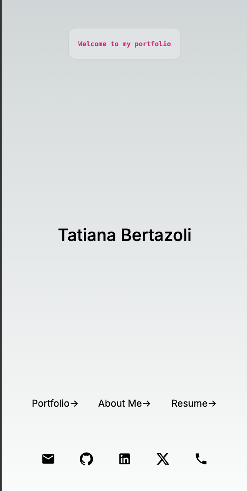
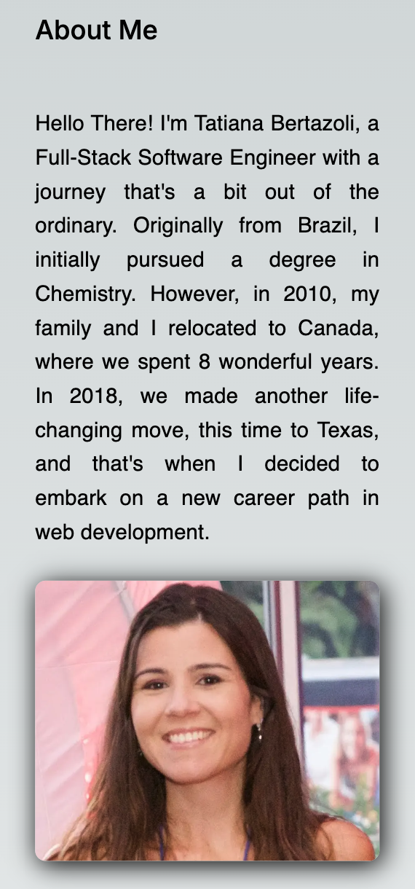
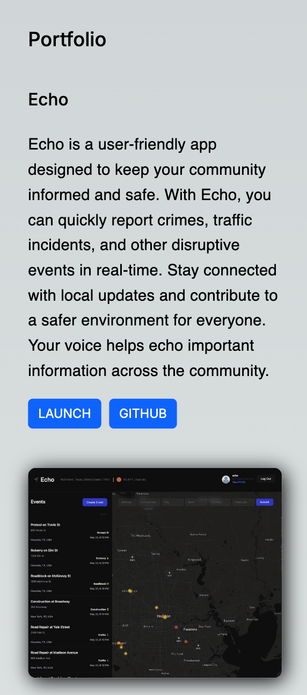

# Portfolio

## Description

Welcome to my portfolio! Here, I showcase a selection of projects I’ve developed throughout my career. This website was built using the Next.js framework and is hosted on Vercel. It features an "About Me" section with my photo and a brief introduction, as well as a "Portfolio" section highlighting some of my projects, each with a link to the live application and its GitHub repository. Additionally, you can find a downloadable PDF version of my resume.

   

   

   

## Table of contents

- [Description](#description)
- [Installation](#installation)
- [Usage](#usage)
- [Credits](#credits)
- [License](#license)
- [Contribution](#contribution)
- [Test](#test)
- [Questions](#questions)

## Installation

If you clone the code from git you need to install the npm packages first on the root folder. Through terminal type `npm install`.

## Usage

Through terminal on the root folder `npm start`

## Credits

Tatiana Bertazoli

## License

   

## Contribution

N/A

## Test

N/A

## Questions

For questions please contact: https://github.com/TBertazoli

GitHub repository link: https://github.com/TBertazoli/Portfolio

Deployed Website Link:https://tatiana.bertazoli.com

email: tatianabertazoli@gmail.com
